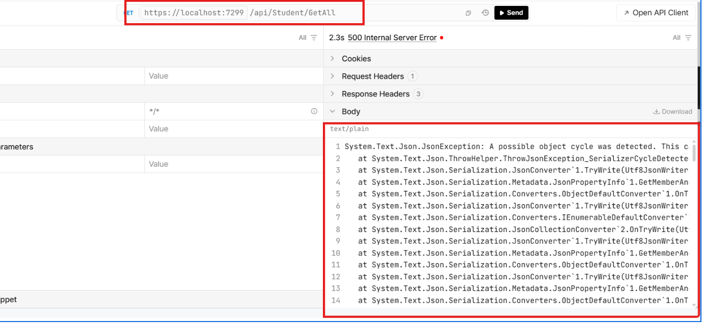
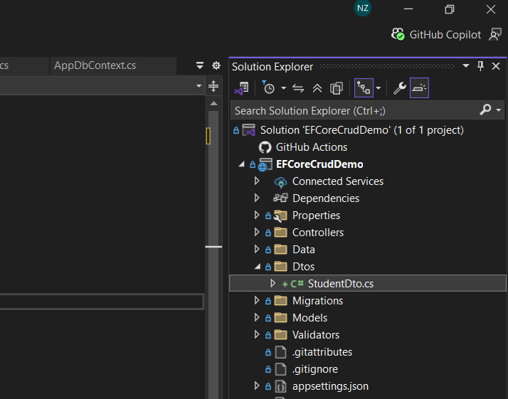

# DTOs in ASP.NET Web API

## Student & Department Model Classes

```csharp
// Department.cs
public class Department
{
    public int DepartmentId { get; set; }
    public string DepartmentName { get; set; }

    public List<Student> Students { get; set; }
}
```

```csharp
// Student.cs
public class Student
{
    public int StudentId { get; set; }
    public string FullName { get; set; }
    public string Email { get; set; }

    [ForeignKey(nameof(DepartmentId))]
    public int DepartmentId { get; set; }

    public Department Department { get; set; }   // Navigation Property
}
```

---

## Cycle Error



---

## Ways to Handle Cycles

### a) `[JsonIgnore]`

```csharp
using System.Text.Json.Serialization;

public class Department
{
    public int DepartmentId { get; set; }
    public string DepartmentName { get; set; }

    [JsonIgnore]
    public List<Student> Students { get; set; }
}
```

**Request:**

```
GET /api/students/1
```

**Output (JSON):**

```json
{
  "studentId": 1,
  "fullName": "Amit",
  "email": "amit@example.com",
  "departmentId": 10
}
```

---

### b) `ReferenceHandler.IgnoreCycles`

```csharp
// Program.cs
builder.Services.AddControllers()
    .AddJsonOptions(options =>
    {
        options.JsonSerializerOptions.ReferenceHandler =
            System.Text.Json.Serialization.ReferenceHandler.IgnoreCycles;
    });
```

**Effect:** Serializer detects the repeated object automatically → sets it to `null` instead of throwing.

**Output (JSON):**

```json
{
  "studentId": 1,
  "fullName": "Amit",
  "email": "amit@example.com",
  "departmentId": 10,
  "department": {
    "departmentId": 10,
    "departmentName": "CS",
    "students": null
  }
}
```

---

## c) DTOs

### What is a DTO?

A **DTO (Data Transfer Object)** is a class used to transfer data between the client and the server.

### Why It's Required

- Hides sensitive fields
- Avoids extra `null` values in the response
- Controls exactly what data is sent when posting/receiving data

### How to Create DTOs



---

## How to Decide Which Fields Go in the DTO

### Available Entity Fields

**Student Table**

| #   | Field Name        |
| --- | ----------------- |
| 1   | StudentId         |
| 2   | FullName          |
| 3   | Email             |
| 4   | DepartmentId (FK) |
| 5   | DateOfBirth       |
| 6   | EnrollmentNumber  |
| 7   | IsActive          |
| 8   | CreatedBy         |
| 9   | CreatedDate       |
| 10  | ProfileImagePath  |

**Department Table**

| #   | Field Name     |
| --- | -------------- |
| 1   | DepartmentId   |
| 2   | DepartmentName |

### Step 1: Analyze Each Endpoint's Field Requirement

| #   | Endpoint          | Fields Required                                                                                |
| --- | ----------------- | ---------------------------------------------------------------------------------------------- |
| 1   | **GetAll**        | FullName, Email, DepartmentId, DepartmentName, DateOfBirth, EnrollmentNumber, ProfileImagePath |
| 2   | **Post (Create)** | FullName, Email, DepartmentId, DateOfBirth, EnrollmentNumber, ProfileImagePath                 |
| 3   | **Update**        | StudentId, FullName, Email, DepartmentId, DateOfBirth, EnrollmentNumber, ProfileImagePath      |
| 4   | **Delete**        | StudentId                                                                                      |

### Step 2: Build the Final DTO Field List

| Field Name       | Notes                                   |
| ---------------- | --------------------------------------- |
| StudentId        | Optional — only used for Update, Delete |
| FullName         | Required                                |
| Email            | Required                                |
| DateOfBirth      | Required                                |
| EnrollmentNumber | Required                                |
| ProfileImagePath | Required                                |
| DepartmentId     | Required                                |
| DepartmentName   | Optional — only used for GetAll         |

**Not Required in DTO:**

- IsActive
- CreatedBy
- CreatedDate

### Final DTO Class

```csharp
public class StudentDTO
{
    public int? StudentId { get; set; }
    public string FullName { get; set; }
    public string Email { get; set; }
    public DateOnly DateOfBirth { get; set; }
    public string ProfileImagePath { get; set; }
    public string EnrollmentNumber { get; set; }
    public int DepartmentId { get; set; }

    public string? DepartmentName { get; set; }
}
```

<span style="color:red"><strong><em>Note: In a DTOs Class Not Add the Navigation Property, Also Keep in Mind DTOs class Not Connect to Your Actual DB</em></strong></span>

## Use DTOs in StudentController CRUD

### GetALL

```csharp
 [HttpGet]
    public async Task<IActionResult> GetAllStudents()
    {
        var students = await _context.Students
            .Select(s => new StudentDTO
            {
                FullName = s.FullName,
                Email = s.Email,
                DateOfBirth = s.DateOfBirth,
                EnrollmentNumber = s.EnrollmentNumber,
                ProfileImagePath = s.ProfileImagePath,
                DepartmentId = s.DepartmentId,
                DepartmentName = s.Department.DepartmentName
            })
            .ToListAsync();

        return Ok(students);
    }
```

### Post

```csharp
[HttpPost]
public async Task<IActionResult> CreateStudent([FromBody] StudentDTO studentDto)
{
    var student = new Student
    {
        FullName = studentDto.FullName,
        Email = studentDto.Email,
        DateOfBirth = studentDto.DateOfBirth,
        EnrollmentNumber = studentDto.EnrollmentNumber,
        ProfileImagePath = studentDto.ProfileImagePath,
        DepartmentId = studentDto.DepartmentId
    };

    _context.Students.Add(student);
    await _context.SaveChangesAsync();

    return Ok("Student Created Successfully");
}
```

### Update

```csharp

[HttpPut("{id}")]
public async Task<IActionResult> UpdateStudent(int id, [FromBody] StudentDTO studentDto)
{

    var student = await _context.Students.FindAsync(id);

    if (student == null)
        return NotFound("Student Not Found");

    student.FullName = studentDto.FullName;
    student.Email = studentDto.Email;
    student.DateOfBirth = studentDto.DateOfBirth;
    student.EnrollmentNumber = studentDto.EnrollmentNumber;
    student.ProfileImagePath = studentDto.ProfileImagePath;
    student.DepartmentId = studentDto.DepartmentId;

    await _context.SaveChangesAsync();

    return Ok("Student Updated Successfully");
}
```

### Delete

```csharp
[HttpDelete]
public async Task<IActionResult> DeleteStudent([FromBody] StudentDTO studentDto)
{
    if (studentDto.StudentId == null)
        return BadRequest("StudentId is Required");

    var student = await _context.Students.FindAsync(studentDto.StudentId);

    if (student == null)
       return NotFound("Student Not Found");
    _context.Students.Remove(student);
    await _context.SaveChangesAsync();

    return Ok("Student Deleted Successfully");
}
```
