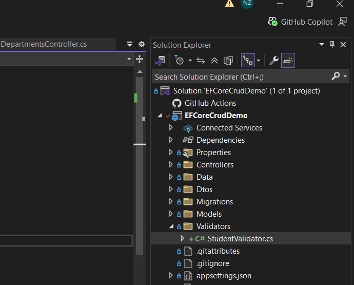
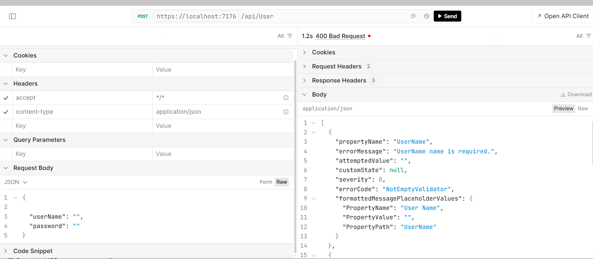
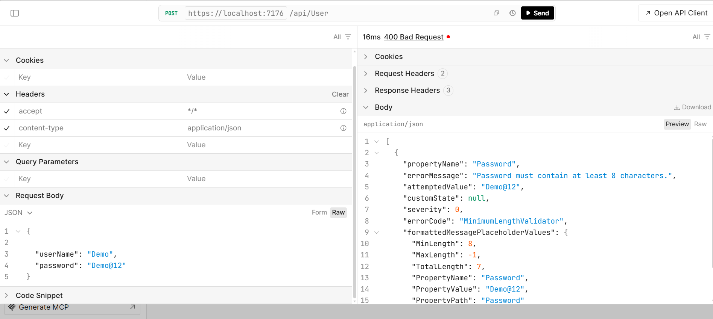
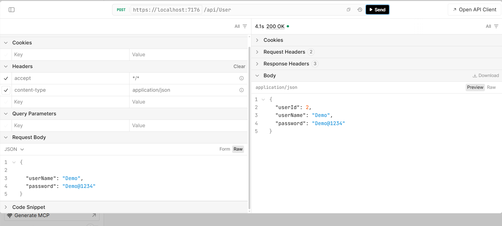

# FluentValidation — Part 1 (Basics)

**Covers:** `NotNull()`, `NotEmpty()`, `Equal()`, `NotEqual()`, `Length()`, `MinimumLength()`, `MaximumLength()`, `LessThan()`, `LessThanOrEqualTo()`, `GreaterThan()`, `GreaterThanOrEqualTo()`, `WithName()`

---

## 1. What Is FluentValidation?

FluentValidation is a .NET library used to validate models with clean, readable C# rules.

Instead of placing validation attributes inside the model:

```csharp
[Required]
[MinLength(3)]
public string StudentName { get; set; }
```

we create a separate validator class:

```csharp
RuleFor(student => student.StudentName)
    .NotEmpty()
    .MinimumLength(3);
```

---

## 2. Why Use FluentValidation?

FluentValidation helps us:

- Keep validation rules separate from the model.
- Write complex validation rules easily.
- Create reusable and readable validation logic.
- Keep controllers cleaner.

---

## 3. Install the Package

Open **Package Manager Console** and run:

```powershell
Install-Package FluentValidation.AspNetCore
```

Or use the .NET CLI:

```bash
dotnet add package FluentValidation.AspNetCore
```

---

## 4. The Student Model We'll Use

```csharp
namespace EFCoreCrudDemo.Models;

public class Student
{
    public int StudentId { get; set; }
    public string StudentName { get; set; } = string.Empty;
    public string StudentEmail { get; set; } = string.Empty;
    public int DepartmentId { get; set; }
    public int Age { get; set; }
    public string Password { get; set; } = string.Empty;
    public string ConfirmPassword { get; set; } = string.Empty;
}
```

We added `Age`, `Password`, and `ConfirmPassword` just for this part, so we have real fields to test number and comparison rules on.

---

## 5. Create the `Validators` Folder and `StudentValidator` Class

Before writing any rules, set up a dedicated place for validators — this keeps validation logic out of the models and controllers, which is the whole point of FluentValidation.

**Steps:**

1. In **Solution Explorer**, right-click the project (`EFCoreCrudDemo`) → **Add** → **New Folder** → name it **`Validators`**.
2. Right-click the new **Validators** folder → **Add** → **Class** → name it **`StudentValidator.cs`**.
3. Make the class inherit from `AbstractValidator<Student>` (provided by FluentValidation) and add a constructor where the rules will live.

Your Solution Explorer should look like this once the folder and file are created:



**`Validators/StudentValidator.cs`** (starting shell — rules are added in the next sections):

```csharp
using EFCoreCrudDemo.Models;
using FluentValidation;

namespace EFCoreCrudDemo.Validators;

public class StudentValidator : AbstractValidator<Student>
{
    public StudentValidator()
    {
        // Rules will be added here (see Section 6 onward)
    }
}
```

### Register the Validator in `Program.cs`

FluentValidation won't know this class exists until it's registered in the DI container. Open **`Program.cs`** and add it near your other `builder.Services` registrations, **before** `builder.Build()`:

```csharp
using EFCoreCrudDemo.Validators;

// ...existing code...

builder.Services.AddScoped<StudentValidator>();

// ...existing code...

var app = builder.Build();
```

> 💡 `AddScoped` is used because a new validator instance is created per request — matching the lifetime of the `DbContext` and controller.

---

## 6. `NotNull()` vs `NotEmpty()`

These are the two most-used rules, and beginners often mix them up.

| Rule         | Rejects                                                                                          |
| ------------ | ------------------------------------------------------------------------------------------------ |
| `NotNull()`  | Only `null`                                                                                      |
| `NotEmpty()` | `null`, `""`, `" "` (whitespace), empty collections `[]`, and default values like `0` or `false` |

```csharp
RuleFor(student => student.StudentName)
    .NotNull()
    .WithMessage("Student name cannot be null.");

RuleFor(student => student.StudentName)
    .NotEmpty()
    .WithMessage("Student name is required.");
```

If `StudentName` is an empty string `""`, `NotNull()` will **not** catch it, because `""` is not `null`. That's why `NotEmpty()` is used far more often for strings.

---

## 7. `Length()`, `MinimumLength()`, `MaximumLength()`

### `MinimumLength(3)`

Value must have **at least** 3 characters.

```csharp
RuleFor(student => student.StudentName)
    .MinimumLength(3)
    .WithMessage("Student name must contain at least 3 characters.");
```

### `MaximumLength(50)`

Value must have **no more than** 50 characters.

```csharp
RuleFor(student => student.StudentName)
    .MaximumLength(50)
    .WithMessage("Student name cannot contain more than 50 characters.");
```

### `Length(min, max)`

Combines both checks in a single call.

```csharp
RuleFor(student => student.StudentName)
    .Length(3, 50)
    .WithMessage("Student name must be between 3 and 50 characters.");
```

**Example:**

| Input    | MinimumLength(3) | MaximumLength(50) | Length(3,50) |
| -------- | ---------------- | ----------------- | ------------ |
| `"Na"`   | ❌ Fail          | ✅ Pass           | ❌ Fail      |
| `"Nand"` | ✅ Pass          | ✅ Pass           | ✅ Pass      |

---

## 8. Comparison Rules

These work on numbers, dates, and any comparable type.

| Rule                       | Condition to Pass | Field Example  | Boundary Value | Pass Example  | Fail Example  |
| -------------------------- | ----------------- | -------------- | -------------- | ------------- | ------------- |
| `GreaterThan(0)`           | value `>` 0       | `DepartmentId` | `0` excluded   | `5 > 0` ✅    | `0 > 0` ❌    |
| `GreaterThanOrEqualTo(18)` | value `>=` 18     | `Age`          | `18` included  | `18 >= 18` ✅ | `17 >= 18` ❌ |
| `LessThan(60)`             | value `<` 60      | `Age`          | `60` excluded  | `59 < 60` ✅  | `60 < 60` ❌  |
| `LessThanOrEqualTo(60)`    | value `<=` 60     | `Age`          | `60` included  | `60 <= 60` ✅ | `61 <= 60` ❌ |

**Quick rule of thumb:**

- "Than" → strict (no equals)
- "ThanOrEqualTo" → boundary included

**Example usage:**

```csharp
RuleFor(student => student.DepartmentId)
    .GreaterThan(0)
    .WithMessage("Department Id must be greater than 0.");

RuleFor(student => student.Age)
    .GreaterThanOrEqualTo(18).WithMessage("Age must be 18 or above.")
    .LessThanOrEqualTo(60).WithMessage("Age must be 60 or below.");
```

---

## 9. `Equal()` and `NotEqual()`

Used to compare two properties of the **same object** — the classic example is password confirmation.

### `Equal()`

```csharp
RuleFor(student => student.ConfirmPassword)
    .Equal(student => student.Password)
    .WithMessage("Passwords do not match.");
```

### `NotEqual()`

```csharp
RuleFor(student => student.Password)
    .NotEqual("Password123")
    .WithMessage("Please choose a less common password.");
```

You can compare against:

- Another property (`Equal(x => x.Password)`)
- A fixed/constant value (`Equal("Admin")`)

---

## 10. `WithName()` — Renaming a Property in Error Messages

By default, error messages use the **C# property name** (e.g., `StudentName`). Sometimes we want a friendlier label for the client — especially useful for front-end display.

```csharp
RuleFor(student => student.StudentName)
    .NotEmpty()
    .WithName("Full Name")
    .WithMessage("{PropertyName} is required.");
```

**Before `WithName()`:**

```json
{ "propertyName": "StudentName", "errorMessage": "StudentName is required." }
```

**After `WithName("Full Name")`:**

```json
{ "propertyName": "StudentName", "errorMessage": "Full Name is required." }
```

Notice `{PropertyName}` is a placeholder token — FluentValidation automatically inserts whatever name is currently active (either the real property name, or the one set by `WithName()`).

---

## 11. Putting It All Together

This completes the `StudentValidator.cs` file created back in Section 5:

```csharp
using EFCoreCrudDemo.Models;
using FluentValidation;

namespace EFCoreCrudDemo.Validators;

public class StudentValidator : AbstractValidator<Student>
{
    public StudentValidator()
    {
        RuleFor(student => student.StudentName)
            .NotEmpty().WithMessage("Student name is required.")
            .Length(3, 50).WithMessage("Student name must be between 3 and 50 characters.")
            .WithName("Full Name");

        RuleFor(student => student.Age)
            .GreaterThanOrEqualTo(18).WithMessage("Age must be 18 or above.")
            .LessThanOrEqualTo(60).WithMessage("Age must be 60 or below.");

        RuleFor(student => student.DepartmentId)
            .GreaterThan(0).WithMessage("Department Id must be greater than 0.");

        RuleFor(student => student.ConfirmPassword)
            .Equal(student => student.Password)
            .WithMessage("Passwords do not match.");
    }
}
```

---

## 12. Inject the Validator into the Controller

```csharp
using EFCoreCrudDemo.Models;
using EFCoreCrudDemo.Validators;
using FluentValidation;
using Microsoft.AspNetCore.Mvc;

namespace EFCoreCrudDemo.Controllers;

[ApiController]
[Route("api/[controller]")]
public class StudentsController : ControllerBase
{
    private readonly StudentValidator _studentValidator;
    public StudentsController(StudentValidator studentValidator)
    {
        _studentValidator = studentValidator;
    }
}
```

---

## 13. Validate the Request

```csharp
[HttpPost]
public async Task<IActionResult> Create(
    Student student
)
{
    var validationResult =
        await _studentValidator.ValidateAsync(student);

    if (!validationResult.IsValid)
    {
        return BadRequest(
            validationResult.Errors
        );
    }

    return Ok(student);
}
```

### Validation Flow

```text
Client sends Student JSON
            ↓
Controller receives Student
            ↓
StudentValidator runs
            ↓
Valid?
   ↓              ↓
 Yes             No
   ↓              ↓
Save/Return     400 Bad Request
```

---

## 14. Testing the Validator with an API Client

With the validator wired up, send a few `POST` requests to `/api/User` and confirm each rule actually fires as expected.

### 14.1 `NotEmpty()` — Empty Field Rejected

Sending an empty `userName` and `password` triggers the `NotEmptyValidator`, returning a `400 Bad Request` with `"UserName name is required."`



### 14.3 `MinimumLength()` — Password Too Short

Sending `"password": "Demo@12"` (7 characters) triggers the `MinimumLengthValidator` on the password field, returning `"Password must contain at least 8 characters."`



### 14.4 Valid Request — `200 OK`

Once every field satisfies its rules (`"userName": "Demo"`, `"password": "Demo@1234"`), the validator passes and the controller processes the request normally, returning `200 OK` with the saved record.




---
