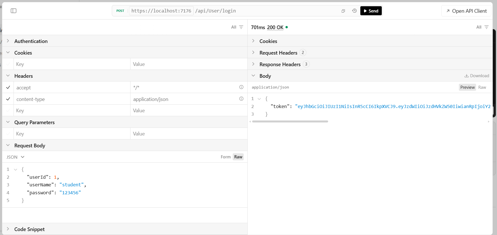
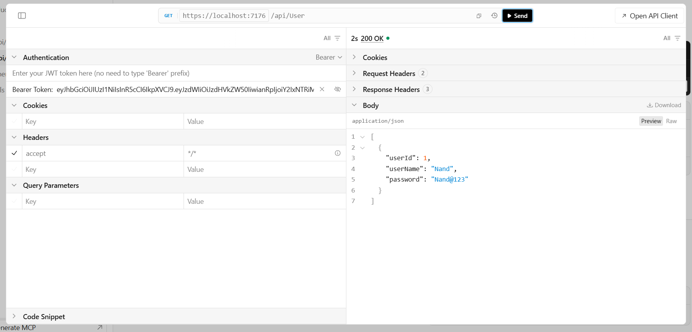
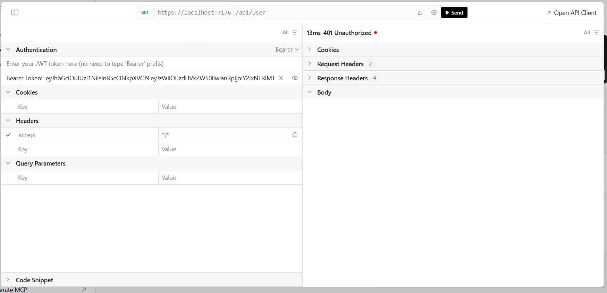

# JWT Authentication in ASP.NET Core Web API

## What is JWT?

JWT is like a digital ID card. When you log in, the server gives you this card (token). You show this card on every next request so the server knows it's you.

## Use Case

Login once → get a token → use that token to access protected APIs without logging in again and again.

---

## Step 1: Install JWT Package

```bash
dotnet add package Microsoft.AspNetCore.Authentication.JwtBearer
```

👉 This package adds the tools needed to create and check JWT tokens in your project.

---

## Step 2: Create User Model

**`Models/UserModel.cs`**

```csharp
namespace JWTDemo.Models
{
    public class UserModel
    {
        public int UserId { get; set; }
        public string UserName { get; set; }
        public string Password { get; set; }
    }
}
```

👉 Just a simple class to hold login info: user id, username, and password.

---

## Step 3: Add JWT Settings in `appsettings.json`

```json
{
  "Logging": {
    "LogLevel": {
      "Default": "Information",
      "Microsoft.AspNetCore": "Warning"
    }
  },
  "AllowedHosts": "*",
  "Jwt": {
    "Key": "GQvOn3RiR/PEVdHtEv+f3z6F2x9A1z5d9h14Wg7NV9I=",
    "Issuer": "JwtDemoApi",
    "Audience": "JwtDemoApiUsers",
    "ExpiresInMinutes": 60
  }
}
```

👉 `Key` = secret password to lock/unlock the token. `Issuer` = who made the token. `Audience` = who can use it. `ExpiresInMinutes` = how long the token stays valid.

---

## Step 4: Configure JWT Authentication in `Program.cs`

```csharp
using System.Text;
using Microsoft.AspNetCore.Authentication.JwtBearer;
using Microsoft.IdentityModel.Tokens;

builder.Services.AddAuthentication(options =>
{
    options.DefaultAuthenticateScheme = JwtBearerDefaults.AuthenticationScheme;
    options.DefaultChallengeScheme = JwtBearerDefaults.AuthenticationScheme;
})
.AddJwtBearer(options =>
{
    options.TokenValidationParameters = new TokenValidationParameters
    {
        ValidateIssuer = true,
        ValidateAudience = true,
        ValidateLifetime = true,
        ValidateIssuerSigningKey = true,

        ValidIssuer = builder.Configuration["Jwt:Issuer"],
        ValidAudience = builder.Configuration["Jwt:Audience"],
        IssuerSigningKey = new SymmetricSecurityKey(
            Encoding.UTF8.GetBytes(builder.Configuration["Jwt:Key"]!)
        )
    };
});
```

👉 This tells the app: "From now on, check every token — is it from the right issuer, right audience, not expired, and signed with our secret key?" If any check fails, the request is auto-rejected.

- `ValidateIssuer` fails → token wasn't made by _your_ API → rejected
- `ValidateAudience` fails → token wasn't meant for _this_ app → rejected
- `ValidateLifetime` fails → token's expired → rejected
- `ValidateIssuerSigningKey` fails → token's seal doesn't match your secret `Key` → rejected

Any one of these failing = straight to `401 Unauthorized`.

---

## Step 5: Create `TokenService.cs` & Register in `Program.cs`

**`Services/TokenService.cs`**

```csharp
using System.IdentityModel.Tokens.Jwt;
using System.Security.Claims;
using System.Text;
using JWTDemo.Models;
using Microsoft.IdentityModel.Tokens;

namespace JWTDemo.Services
{
    public class TokenService
    {
        private readonly IConfiguration _config;

        public TokenService(IConfiguration config)
        {
            _config = config;
        }

        public string GenerateToken(UserModel user)
        {
            var claims = new[]
            {
                new Claim(JwtRegisteredClaimNames.Sub, user.UserName),
                new Claim(JwtRegisteredClaimNames.Jti, Guid.NewGuid().ToString())
            };

            var key = new SymmetricSecurityKey(
                Encoding.UTF8.GetBytes(_config["Jwt:Key"]!)
            );
            var credentials = new SigningCredentials(key, SecurityAlgorithms.HmacSha256);

            var token = new JwtSecurityToken(
                issuer: _config["Jwt:Issuer"],
                audience: _config["Jwt:Audience"],
                claims: claims,
                expires: DateTime.UtcNow.AddMinutes(
                    double.Parse(_config["Jwt:ExpiresInMinutes"]!)),
                signingCredentials: credentials
            );

            return new JwtSecurityTokenHandler().WriteToken(token);
        }
    }
}
```

👉 This is the "token factory," and it's the only piece of logic we pull out of the controller:

- **`claims`** — the info printed on the ID card (username, unique token ID).
- **`SymmetricSecurityKey` + `SigningCredentials`** — the wax seal, locking the card with our secret `Key`.
- **`JwtSecurityToken`** — the actual card, stamped with issuer, audience, claims, seal, expiry.
- **`WriteToken()`** — turns the card into the long string (`eyJhbGci...`) you send around.

**Register in `Program.cs`:**

```csharp
builder.Services.AddScoped<TokenService>();
```

👉 This makes `TokenService` available so `UserController` can ask for it in its constructor.

---

## Step 6: Login Endpoint — Use `TokenService` in the Controller

**`Controllers/UserController.cs`**

```csharp
using JWTDemo.Models;
using JWTDemo.Services;
using Microsoft.AspNetCore.Authorization;
using Microsoft.AspNetCore.Mvc;

namespace JWTDemo.Controllers
{
    [ApiController]
    [Route("api/[controller]")]
    public class UserController : ControllerBase
    {
        private readonly TokenService _tokenService;

        public UserController(TokenService tokenService)
        {
            _tokenService = tokenService;
        }

        [HttpPost("login")]
        public IActionResult Login([FromBody] UserModel request)
        {
            // Demo hardcoded user (UserName: student, Password: 123456)
            if (request.UserName != "student" || request.Password != "123456")
            {
                return Unauthorized("Invalid username or password");
            }

            var token = _tokenService.GenerateToken(request);
            return Ok(new { token });
        }

        [Authorize]
        [HttpGet]
        public IActionResult GetAll()
        {
            return Ok("This is protected data!");
        }
    }
}
```

👉 `Login()` checks the username/password. If correct → asks `TokenService` to make a token and sends it back. If wrong → sends `401 Unauthorized`. `[Authorize]` on `GetAll()` locks that endpoint — no valid token → `401 Unauthorized`.

---

## Step 7: Add Middleware in `Program.cs` (Order Matters)

```csharp
app.UseHttpsRedirection();
app.UseAuthentication();
app.UseAuthorization();
app.MapControllers();
```

👉 `UseAuthentication()` = "check who you are" (reads the token). `UseAuthorization()` = "check what you're allowed to do." Authentication must always come first.

**Order cheat sheet (memorize this):**
`UseAuthentication()` → `UseAuthorization()` → `MapControllers()`

Flip Authentication and Authorization, and `[Authorize]` basically stops working — so if your locked endpoints aren't locking, check this order first.

---

## Step 8: Add Scalar for Easy Testing (Optional but Handy)

```csharp
builder.Services.AddOpenApi(options =>
{
    options.AddDocumentTransformer((document, context, cancellationToken) =>
    {
        document.Components ??= new();
        document.Components.SecuritySchemes.Add("Bearer", new()
        {
            Type = Microsoft.OpenApi.Models.SecuritySchemeType.Http,
            Scheme = "bearer",
            BearerFormat = "JWT",
            In = Microsoft.OpenApi.Models.ParameterLocation.Header,
            Description = "Enter your JWT token here (no need to type 'Bearer' prefix)"
        });
        return Task.CompletedTask;
    });
});

// after var app = builder.Build();
if (app.Environment.IsDevelopment())
{
    app.MapOpenApi();
    app.MapScalarApiReference();
}
```

👉 This adds a **"Bearer" security scheme** to the OpenAPI doc, which makes the **Authentication → Bearer Token** box show up in Scalar. Without it, you'd have no easy place to paste your JWT in the UI.

**Why bother vs Postman/curl?** You can test with Postman or curl by manually adding an `Authorization: Bearer <token>` header — works fine, just more typing. Scalar just saves you that hassle.

---

## Step 9: Test the Full Flow in Scalar

**1️⃣ Generate the token — `POST /api/User/login`**

Send the demo credentials (`student` / `123456`). Scalar returns a `200 OK` with a `token` in the response body — copy this value.



**2️⃣ Call the protected endpoint with the correct token**

Open the **Authentication** section on `GET /api/User`, choose **Bearer**, paste the token you copied (no need to type the `Bearer` prefix — Scalar adds it), and hit **Send**. You get a `200 OK` with the protected data.



**3️⃣ Call the protected endpoint with a wrong/missing token**

If the token is missing, edited, expired, or just wrong, `[Authorize]` rejects the request with `401 Unauthorized` — no body is returned.



```bash
dotnet run
```

Open Scalar: `https://localhost:{port}/scalar/v1`

```

## Common Errors

| Error                             | Simple Reason                                                          |
| --------------------------------- | ---------------------------------------------------------------------- |
| `401 Unauthorized`                | Token missing, wrong, or expired                                       |
| `500` error on login              | `Jwt:Key` is too short (needs 32+ characters)                          |
| `[Authorize]` not blocking anyone | `UseAuthentication()` is missing, or placed after `UseAuthorization()` |

---
```
