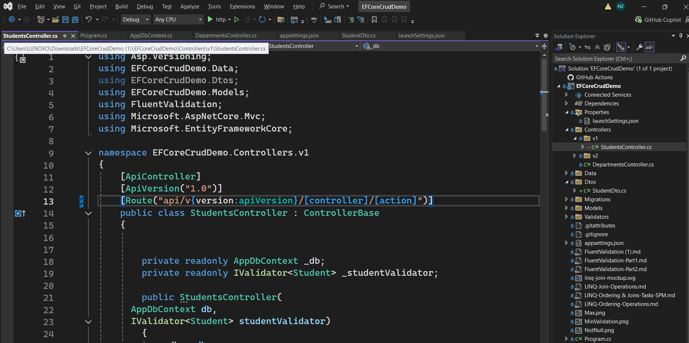

#

# 1. What Is API Versioning?

API Versioning allows us to maintain multiple versions of the same API.

For example:

```http
GET /api/v1/Students
```

Later, we change the API response and create:

```http
GET /api/v2/Students
```

Both versions can work at the same time.

---

# 2. Why Do We Need API Versioning?

Suppose the existing frontend application uses:

```http
GET /api/v1/Students
```

The Version 1 response is:

```json
[
  {
    "studentId": 1,
    "studentName": "Nand",
    "studentEmail": "nand@gmail.com"
    "departmentId": 1,
    "departmentName": "CSE"
  }
]
```

Later, we Remove a field:

```json
{
   "studentEmail": "nand@gmail.com"
}
```

If we directly change Version 1, the old frontend application may be affected.

Therefore, we keep Version 1 unchanged and create Version 2.

```text
Old Frontend
      ?
/api/v1/Students
      ?
Version 1 API


New Frontend
      ?
/api/v2/Students
      ?
Version 2 API
```

---

# 3. Install the Required NuGet Package

Open Visual Studio 2022.

Go to:

````text

Search for:

```text
Asp.Versioning.Mvc
````

Install the latest version compatible with the project framework.

---

# 4. Configure API Versioning in Program.cs

Open:

```text
Program.cs
```

Add the following namespace:

```csharp
using Asp.Versioning;
```

Add API Versioning before:

```csharp
var app = builder.Build();
```

Add:

```csharp
builder.Services.AddApiVersioning(options =>
{
    // Use Version 1 when the API version
    // is not specified
    options.AssumeDefaultVersionWhenUnspecified = true;

    // Set Version 1 as the default version
    options.DefaultApiVersion = new ApiVersion(1, 0);

    // Display supported API versions
    // in the response header
    options.ReportApiVersions = true;
});
```

---

# 5 Create Controller Folders

In Visual Studio:

```text
Right Click Controllers
? Add
? New Folder
? Name: V1
```

Create another folder:

```text
Right Click Controllers
? Add
? New Folder
? Name: V2
```

The project structure becomes:

```text
Controllers
?
??? V1
?   ??? StudentsController.cs


??? V2
    ??? StudentsController.cs
```

---

# 6. Create Version 1 Students Controller

Create:

```text
Controllers
? V1
? StudentsController.cs
```

---

# 7. Add Route Attribute for Versioning

Inside `StudentsController.cs` (in the `V1` folder), add the `[ApiVersion]` and `[Route]` attributes above the class:

```csharp
[ApiController]
[ApiVersion("1.0")]
[Route("api/v{version:apiVersion}/[controller]/[action]")]
public class StudentsController : ControllerBase
{
    private readonly AppDbContext _db;
    private readonly IValidator<Student> _studentValidator;

    public StudentsController(
        AppDbContext db,
        IValidator<Student> studentValidator)
    {
        ...
    }
}
```

The `{version:apiVersion}` route token tells ASP.NET Core to read the version number from the URL and match it against the `[ApiVersion]` attribute.



---

# 8. Test Version 1

Run the project.

Open Swagger:

```text
https://localhost:PORT/swagger
```

Test:

```http
GET /api/v1/Students
```

Example:

```text
https://localhost:7001/api/v1/Students
```

The port number may be different on each computer.

---

# 10. Same Create Version 2 Students Controller & Test

```Same Create a new StudentsController in V2 Folder & Test

```

# 11. Compare Version 1 and Version 2

## Version 1

URL:

```http
GET /api/v1/Students
```

Response:

```json
[
  {
    "studentId": 1,
    "studentName": "Nand",
    "studentEmail": "nand@gmail.com",
    "departmentId": 1,
    "departmentName": "CSE"
  }
]
```

---

## Version 2

URL:

```http
GET /api/v2/Students
```

Response:

```json
[
  {
    "studentId": 1,
    "studentName": "Nand",
    "departmentId": 1,
    "departmentName": "CSE"

  }
]
```
